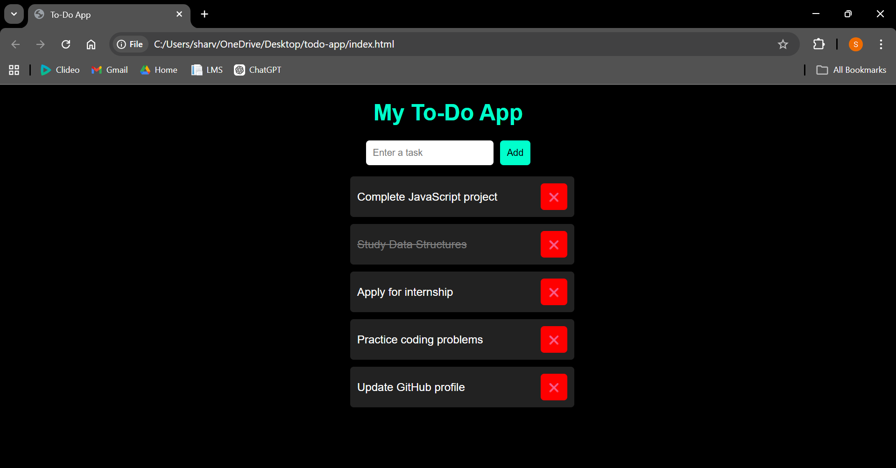

# 📝 To-Do List Web App

A simple and interactive To-Do List application built using HTML, CSS, and JavaScript. This app helps users manage daily tasks efficiently with a clean and user-friendly interface.

---

## ✨ Features

* ➕ Add new tasks
* ❌ Delete tasks
* ✔ Mark tasks as completed
* 💾 Data stored using Local Storage
* 🎨 Simple and responsive UI

---

## 📸 Preview



---

## 🌐 Live App

👉 [Open To-Do App](https://sharvischavan-max.github.io/To-Do-App/?utm_source=chatgpt.com)

---

## 🛠️ Technologies Used

* HTML
* CSS
* JavaScript

---

## ▶️ How to Run Locally

1. Download or clone the repository
2. Open `index.html` in your browser

---

## 📁 Project Structure

```
To-Do-App/
│── index.html
│── style.css
│── script.js
│── todo-preview.png
│── README.md
```

---

## 🚀 Future Improvements

* Add edit task feature
* Add task filters (completed / pending)
* Improve UI design
* Add due dates

---

## ⭐ Project Highlights

This project demonstrates:

* DOM Manipulation
* Event Handling
* Local Storage usage
* Basic Web Development skills

---

💡 A beginner-friendly project showcasing practical JavaScript and frontend development skills.
